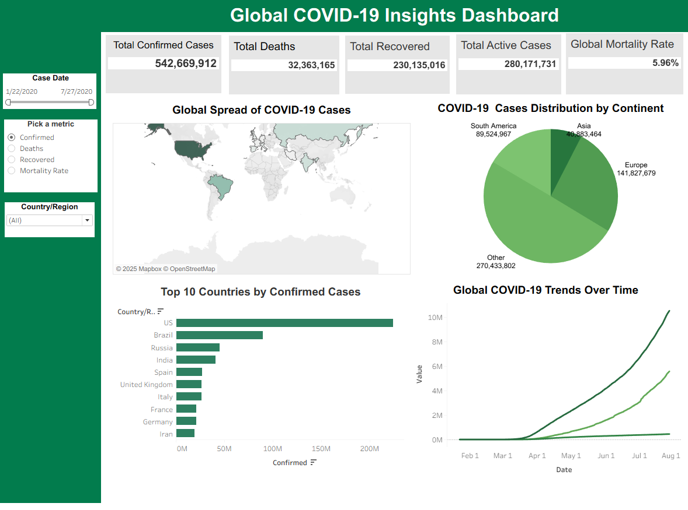

# 🌍 Global COVID-19 Insights Dashboard

This repository presents a Tableau dashboard that visualizes global COVID-19 data to provide key insights into the pandemic's impact across continents and countries. The goal of this project is to help users interactively explore trends in confirmed cases, deaths, recoveries, and mortality rates globally.

---

## 📊 Dashboard Overview

The dashboard titled **"Global COVID-19 Insights Dashboard"** provides the following:

### 📌 Key Metrics Displayed
- **Total Confirmed Cases**: 542,669,912  
- **Total Deaths**: 32,363,165  
- **Total Recovered**: 230,135,016  
- **Total Active Cases**: 280,171,731  
- **Global Mortality Rate**: 5.96%

### 🌐 Interactive Features
- **Time Slider**: Select a specific date range (Jan 22, 2020 – Jul 27, 2020).
- **Metric Selector**: Choose between Confirmed, Deaths, Recovered, or Mortality Rate.
- **Country/Region Filter**: Narrow down data to specific regions.

### 📈 Visual Components
1. **Map View**: Global spread of COVID-19 cases with shaded intensity.
2. **Pie Chart**: COVID-19 case distribution by continent.
3. **Bar Chart**: Top 10 countries by confirmed cases (e.g., US, Brazil, India).
4. **Line Graph**: Trends of confirmed, recovered, and death cases over time globally.

---

## 📁 Dataset

- **Source File**: `b05ff06c-00df-4079-8cea-9c8f0b407655.csv`
- **Contents**:
  - Daily case counts for multiple countries.
  - Columns: `Date`, `Country/Region`, `Confirmed`, `Deaths`, `Recovered`, `Active`, etc.
  - Time period: January 2020 – July 2020.

> Data is structured for visualization in Tableau and supports drill-down and filtering by time and geography.

---

## 🛠 Tools Used

- **Tableau Desktop** – for building interactive and dynamic visualizations.
- **Excel / CSV** – data cleaning and preprocessing.
- **GitHub** – for version control and documentation.

---

## 💡 Insights

- The United States leads in total confirmed cases, followed by Brazil and Russia.
- Europe had the highest case distribution among continents during the observed period.
- The trend graph highlights a sharp rise in confirmed and recovered cases post-April 2020.

---

## 📸 Dashboard Preview

Below is a preview of the Tableau dashboard:

---

## 📌 How to View the Dashboard

To explore the interactive version:

1. Open Tableau Desktop or Tableau Public.
2. Load the dataset (`.csv`).
3. Recreate or import the dashboard using the layout and metrics shown.

---

## 📬 Contact

**Akshay Damodar Prabhu**  
Graduate Student, MPS Analytics – Boston  
📧 Feel free to connect via [LinkedIn](https://www.linkedin.com) or email for questions or collaborations.

---
